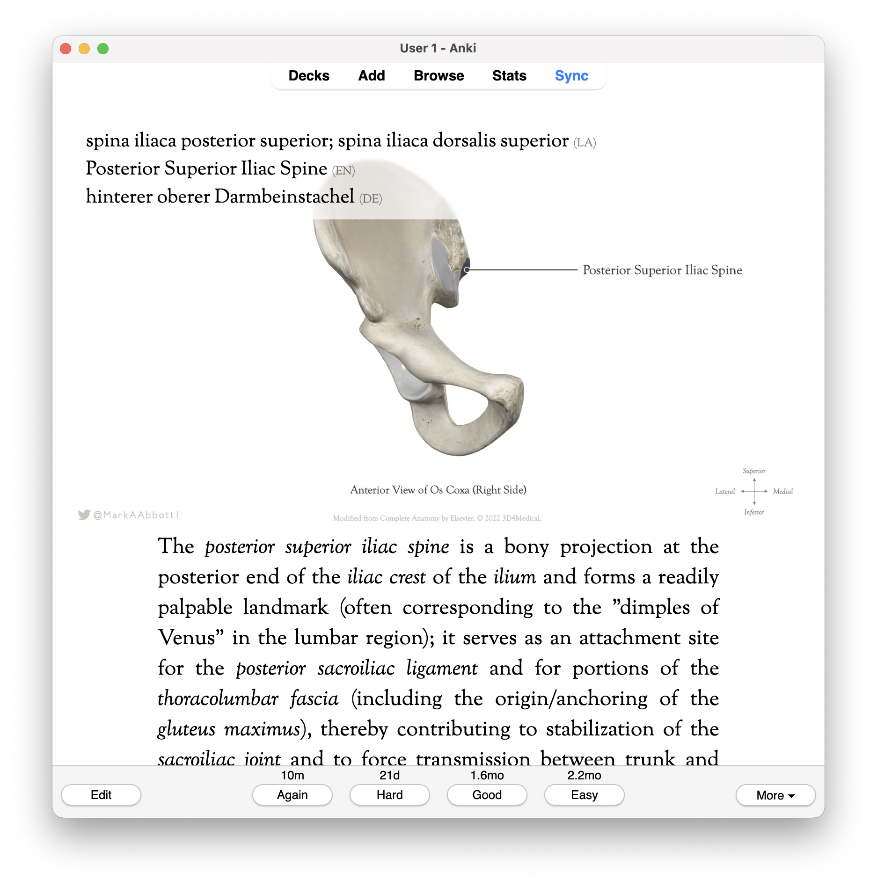
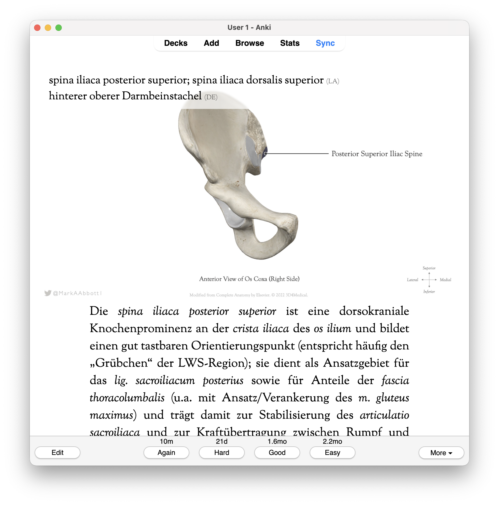
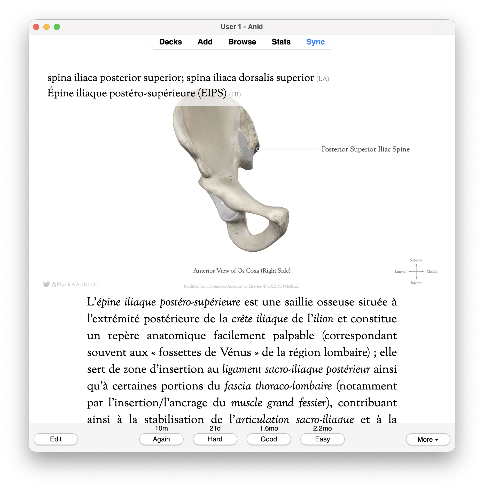
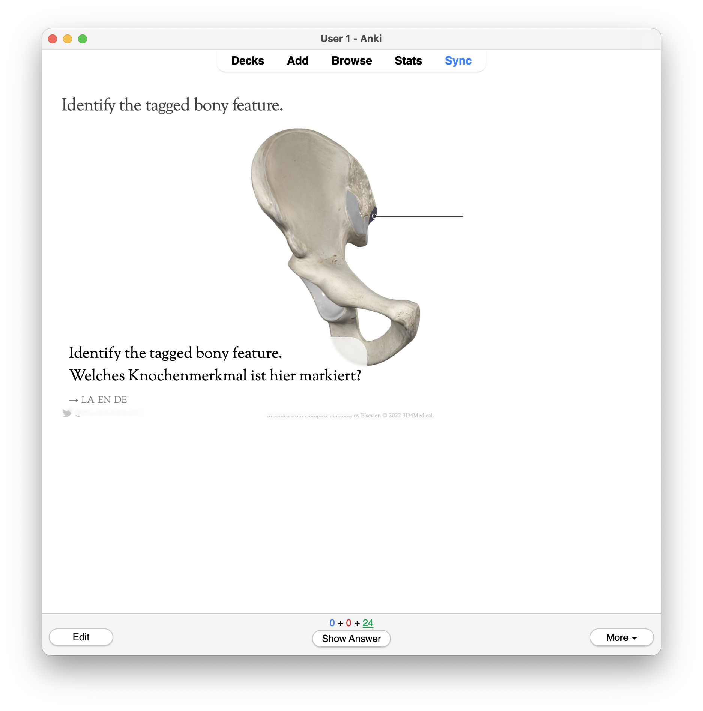
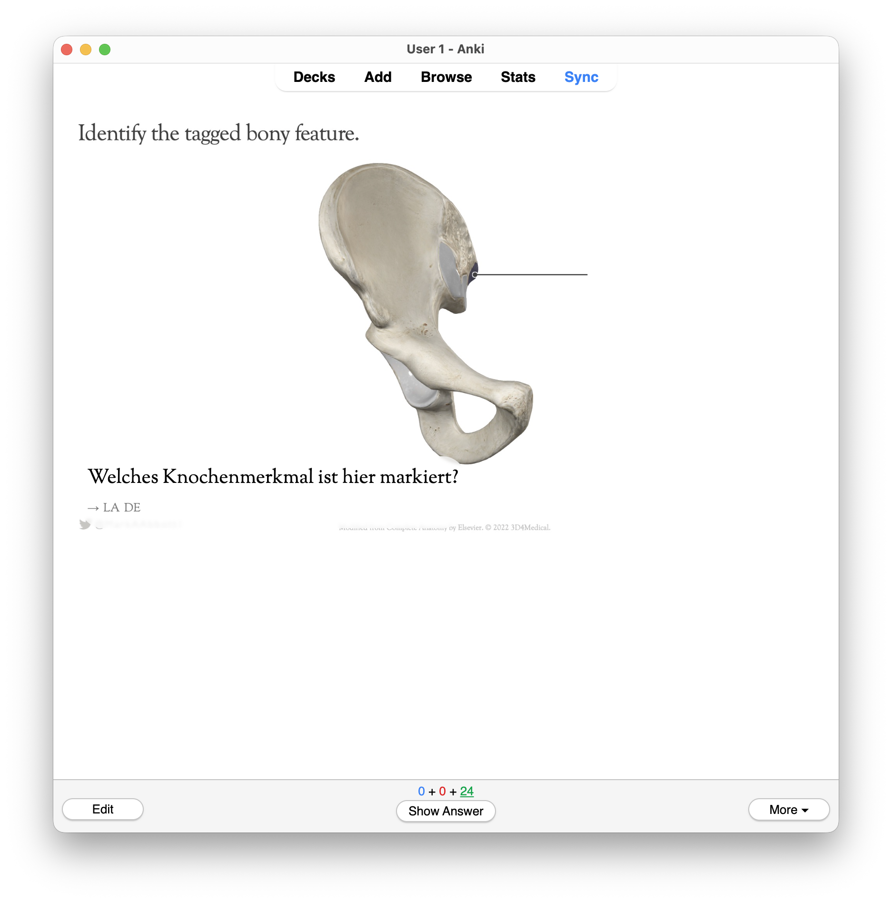
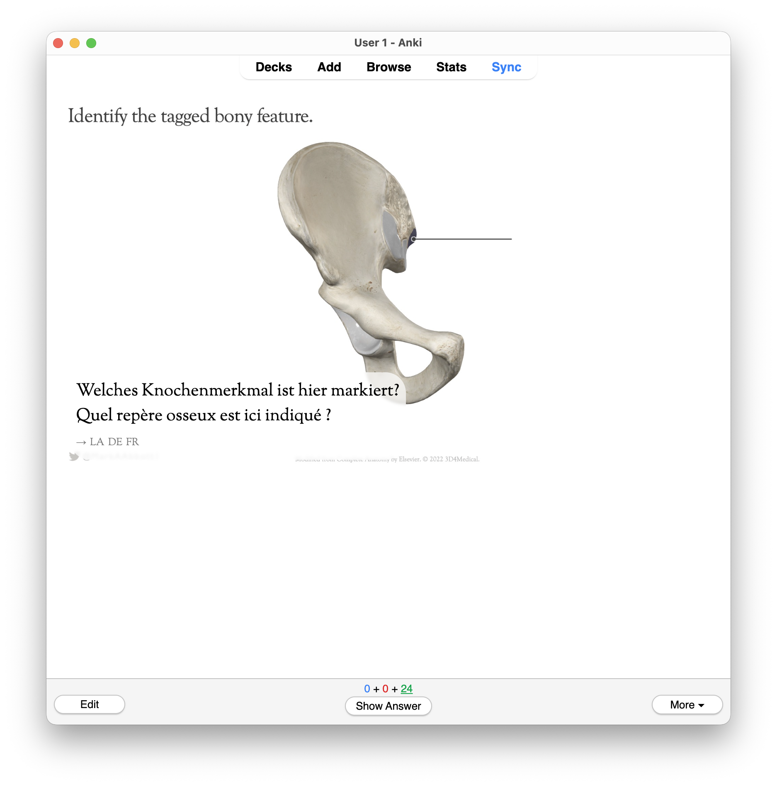
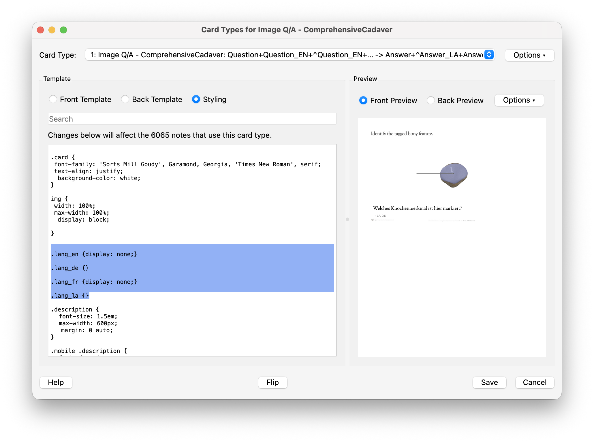

# Screenshots

Reference screenshots used in the main [README](../../README.md).

## Answer renderings

### English

### German

### French

## Question renderings

### English + German

### German only

### German + French

## Language setting

### Styling panel

